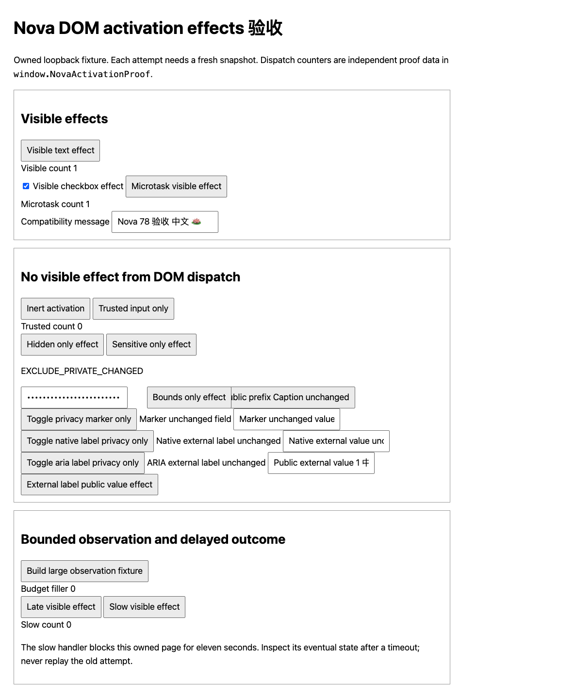

# DOM activation effect acceptance

Nova #78 is one top-document `activate` slice of tracker #23. `{ activated: true }` now requires a fresh bounded public semantic/control difference after one DOM dispatch. The result carries no observed text or value. A no-op, trusted-input-only handler, hidden/private-only change or bounds-only change returns `no_observed_effect`: dispatch may already have had side effects, so read or inspect the page before retrying. This receipt does not prove a remote transaction or causal attribution.

The two observations use the existing visibility, sensitive-control and composed open-shadow traversal. They share cumulative node, character, visit and UTF-8 byte counters, with half of each existing limit reserved per phase and both observation envelopes charged. Neither counter reset nor an increased overall limit is allowed. Roots classified private in either phase are excluded from comparison; that ancestry check spends only the shared remaining visits and returns uncertainty if it cannot finish. Privacy-marker toggles alone cannot confirm an effect. On clipped/truncated observations, only changed semantic fields within the common observed prefix can confirm an effect; a changed length alone cannot. IDs, bounds, capabilities and snapshot metadata are ignored. Changes beyond the observed prefix and later asynchronous effects may remain inconclusive. Observation includes one microtask checkpoint, without polling, a persistent observer, automatic retry or native input fallback.

All existing name-text paths (`aria-labelledby`, native associated labels and direct content fallback) share privacy capture within their existing bounded text walk. If either phase encountered a private name source, descendant or source ancestor, only that control's name is masked in both comparator projections. Public state, value and direct `aria-description` remain eligible evidence. The capture uses the same traversal, shared visits and deadline; later source-ancestry changes cannot erase the recorded influence.

The original absolute content deadline and exact route/revision checks surround observation and dispatch, and content authority is checked again before returning a positive receipt. Expiry after dispatch returns `ambiguous_content_timeout`; authority changes retain their existing typed codes with inspection guidance. The original snapshot remains consumed, including no-effect/error outcomes. Reserved child actions still reject before any top dispatch. Focus, set-value and scroll behavior and value hash/size receipts retain their existing contracts.

## Owned Chrome acceptance

The final v3 candidate was exercised on 2026-10-03 (Asia/Shanghai) in private Chrome for Testing 149.0.7827.54 through the accepted native host/broker. Twenty-two fresh-snapshot activation cases passed: visible text/check/microtask and safe public-value positives; inert/trusted/hidden/sensitive/bounds/privacy-only negatives; both external-label naming paths and privacy directions; both inline content-name privacy directions; large-page prefix changes and the out-of-budget late effect. Twenty-four total DOM dispatches produced zero duplicates. Focus, size/hash-only value writes, actual top scrolling, reserved-child rejection, release/re-pair and old-snapshot rejection passed. One actual native-input trusted-handler positive control is recorded separately from Nova DOM dispatch. The 11-second handler produced one eventual effect after an approximately 5.11-second client timeout; the bridge recovered unpaired and no replay was attempted. Deterministic tests separately verify the original content deadline. Owned Chrome and the fixture server exited normally and the native host disconnected.

The frozen final v3 actual browser manifest SHA256 is `03bf3952894365a215c15168fb823e6c60186848f547d79232f2ca816e82bf3b`. Its external records retain the exact loaded payload, served fixture, native replies, independent fixture counters, raw command logs and real screenshot. Prior v1/v2 evidence is preserved separately; the current candidate was freshly tested. One re-pair request expired during context restoration; one new actual UI-confirmed request succeeded, without action dispatch from the expired request. The actual baseline at accepted Nova `d920e7d6b0448a7a7097325483a2c45396ee8b7f` established inert and trusted-only false-success receipts before implementation, exactly one dispatch each and no visible change, plus a separate native trusted-click control; baseline manifest SHA256 is `77f7a5bc19e23c4931960248b596083052815ccb981143d8c0fb98b96ced07b6`.

Serve `chrome/fixtures/activation-effects.html` from loopback in an owned profile, for example `python3 -m http.server 8765 --bind 127.0.0.1 --directory chrome/fixtures`. Use the existing exact-document temporary enablement/pairing and immutable candidate extension/private host. Preserve daily profiles, primary checkouts, clipboard, installed hosts, TCC and tracker #23's original boxes.

1. From fresh snapshots, activate **Visible text effect**, **Visible checkbox effect** and **Microtask visible effect**. Confirm the public text/check state changes, positive receipts without observed content, and one independent dispatch per action in `window.NovaActivationProof`. A second request using each consumed snapshot must reject without a second dispatch.
2. From fresh snapshots, activate **Inert activation**, **Trusted input only**, **Hidden only effect**, **Sensitive only effect** and **Bounds only effect**. Require typed no-effect receipts and inspection guidance; verify unchanged public semantic state and exactly one dispatch, while independent fixture state confirms the excluded changes. Hidden/private/password fixture text must not appear in semantic reads or receipts. A real owned native click on **Trusted input only** remains a separate positive control.
   Activate **Toggle privacy marker only** in both directions from separate fresh snapshots. The marker field retains its visible content and value; both attempts must be no-effect with one dispatch each.
   Repeat both directions with **Toggle native label privacy only** and **Toggle aria label privacy only**. Their external for/id and `aria-labelledby` sources retain rendered text, while each public input retains its value outside the marked source. Require four no-effect receipts, no raw label/value echo and consumed-snapshot rejection without additional dispatch. During the ARIA private phase, activate **External label public value effect** from a fresh snapshot; its safe public value must change, the external label must remain private, and the positive receipt must contain only `activated: true`.
   Activate the inline-caption button in both directions, first named **Public prefix Caption unchanged**, then **Public prefix** after its caption becomes private. Only `#inline-caption` gains or loses `data-private`; rendered text/style/value stay unchanged. Require two no-effect receipts, inspection guidance, one dispatch each, no raw echo and consumed-snapshot rejection without another dispatch.
3. Build the large fixture, then repeat the visible-text and inert cases. Activate **Late visible effect** once: its handler changes an output after the 800 filler paragraphs, beyond the bounded observations, so require `no_observed_effect` and independently inspect that eventual output without replay. Record read truncation, a confirmed visible prefix change, bounded no-effect behavior, and single dispatch counts. Release access before an action, verify denial without dispatch, enable/pair again, and confirm consumed snapshots still cannot act.
4. Focus **Compatibility message** and set its controlled value from separate fresh snapshots. Verify actual focus/value, unchanged size/hash-only value receipts and snapshot consumption. On the large fixture, scroll the top document from a fresh root handle and verify actual movement with the existing scroll receipt.
5. Optionally activate **Slow visible effect** once. The production content deadline is ten seconds; an external caller may time out earlier. Record the actual typed content or ambiguous client/transport outcome honestly, wait for the page to finish, and inspect eventual public state, route and dispatch count without replay. Deterministic Node tests separately verify the original absolute content deadline before/after dispatch and late authority invalidation.

Retain candidate source/fixture hashes, native receipts, independent DOM/control proof and rendered screenshots. Full extension Node tests, packaged syntax/manifest checks, independent review and all eight exact-head CI checks are required before source and Zenith-pointer delivery. This child changes no Rust/native/broker/protocol, manifest/popup, canonical routing, window identity, child-action, signing or TCC behavior and does not complete #23.
