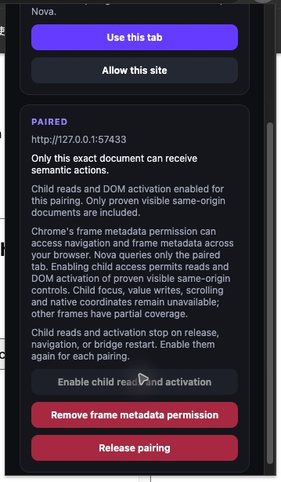
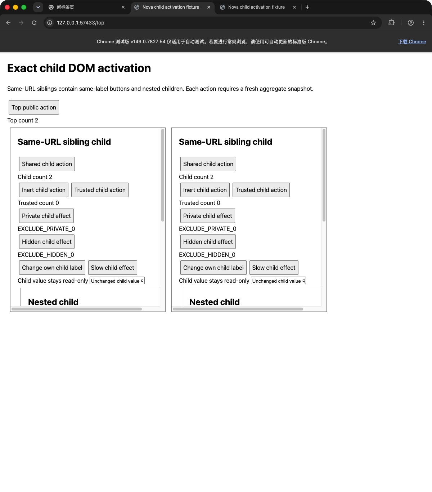

# Same-origin child DOM activation (#80)

For each pairing, **Enable child reads and activation** explicitly permits
bounded reads and DOM `activate` on browser-proven, visible same-origin child
controls. Chrome's optional `webNavigation` permission has browser-wide metadata
capability; Nova queries only the paired tab. A grant alone never restores this
volatile opt-in. Child focus, value writes, scroll and coordinates remain absent.

One aggregate snapshot owns the top bridge's captured DOM handles and bounded
worker browser proof. Same-label/same-URL siblings and nested documents have
distinct scoped IDs. Actions use those references; URLs and names never resolve
targets. Before dispatch, the paired route/epoch, metadata permission, exact
browser document ancestry, original visible non-sensitive owner chain and child
node role/name/type/current activation eligibility must agree. A handler may
change its own label after dispatch. Other active tabs do not affect the target.

Any attempted mutation on the current aggregate consumes it across top/children,
including unsupported actions, forged IDs and preflight failures. A fresh read,
navigation, document/owner replacement, release, disconnect, permission removal
or worker restart cannot authorize an old child handle. There is no per-child
pairing, independent cache, persistent observer or replay/native fallback.

Activation uses #78's public semantic/control comparison in the original child
document, with the original absolute deadline and cumulative observation limits.
Browser and actual-owner checks spend the same remaining visits. Public effects
return only `{ activated: true }`; inert/trusted-only/hidden/private-only effects
are inconclusive and require reading or inspecting before retry, since dispatch
may already have had side effects. Child coordinates are never emitted or used.
#76's shared read limits, depth four/eight-document caps, exclusions and partial
top-only read result on exhausted child coverage remain intact.

Run `node chrome/fixtures/child-activation.mjs` in an owned loopback session. The
printed `/top` has owners `first-child` and `second-child` at the same `/child`
URL, each with `nested-child` at `/nested`. All four documents have
`public-action` named **Shared child action**, plus inert, trusted, hidden,
private-only, own-label and slow controls. `/other-tab` proves active-tab isolation;
`/top?case=exclusions`, `documents` and `/child?case=budget` cover exclusions/caps.
The fixture's independent main-world `NovaChildActivationProof.inspect()` reports
per-document identity/counters and known iframe states. `changeTarget(kind)` and
`changeOwner(ownerId, kind)` produce controlled invalidation without production
routes/state. Require one dispatch, no raw text/value receipt, consumed replay
denial, exact sibling/nested target and compatible top activation. Inspect after
slow/transport ambiguity without replay.

The repaired candidate passed 343/343 extension tests, including 93 focused tests.
Independent review reproduced and fixed an introduced race: an old child reply
must stay stale after a newer read and consumption of its replacement snapshot.
Both newer-child and newer-top variants fail before the repair and pass afterward.
Consumption now retains the same aggregate object with `consumed: true`; pending
work compares its captured object, using the existing lifecycle.

On 2026-10-03, a fresh owned Chrome for Testing 149.0.7827.54 profile loaded the
exact repaired extension and accepted native host. All 51 actual browser cases
passed, with raw bridge receipts and independent main-world document counters:

| Cases | Count |
| --- | ---: |
| Exact sibling/nested activation, public/no-effect receipts, own-label change and top compatibility | 10 |
| Changed child fingerprint/eligibility | 5 |
| Changed owner chain/document and fresh-document recovery | 9 |
| Unsupported/forged targets, fresh-read rejection and aggregate consumption | 7 |
| Another active tab, with zero bystander dispatches | 2 |
| Permission removal, release, worker restart, native disconnect and fresh-pair old-reference rejection | 8 |
| Default top-only, permission denial, grant without opt-in and default after release | 4 |
| Top navigation/new-document rejection and privacy exclusions | 2 |
| Shared node/character limits and eight-document cap | 3 |
| Slow handler with ambiguous client timeout, one dispatch and no replay | 1 |

The slow handler exceeded the native caller's five-second deadline. The caller
reported timeout; a later independent fixture inspection saw the one public
effect. This is ambiguity evidence, not a positive action receipt. Pairing was
revoked and the action was never repeated. The owned browser, host connection
and fixture servers were closed after acceptance; daily profiles, installed
hosts, clipboard and TCC settings were untouched. Earlier #78/#76 and unrepaired
browser evidence are not used to accept this candidate.

This child adds no native/public protocol/permission, cross-origin action,
canonical routing or TCC behavior and does not complete tracker #23. The
pre-existing top-target fingerprint gap is tracked separately in #81.
API references:
[scripting](https://developer.chrome.com/docs/extensions/reference/api/scripting),
[webNavigation](https://developer.chrome.com/docs/extensions/reference/api/webNavigation).
