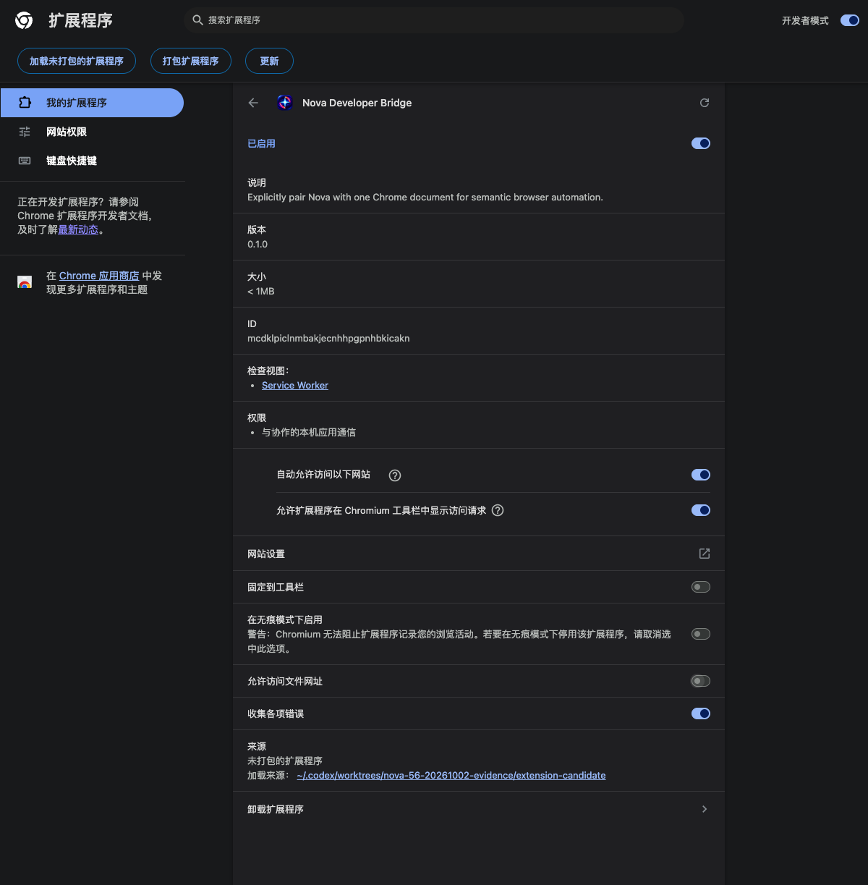
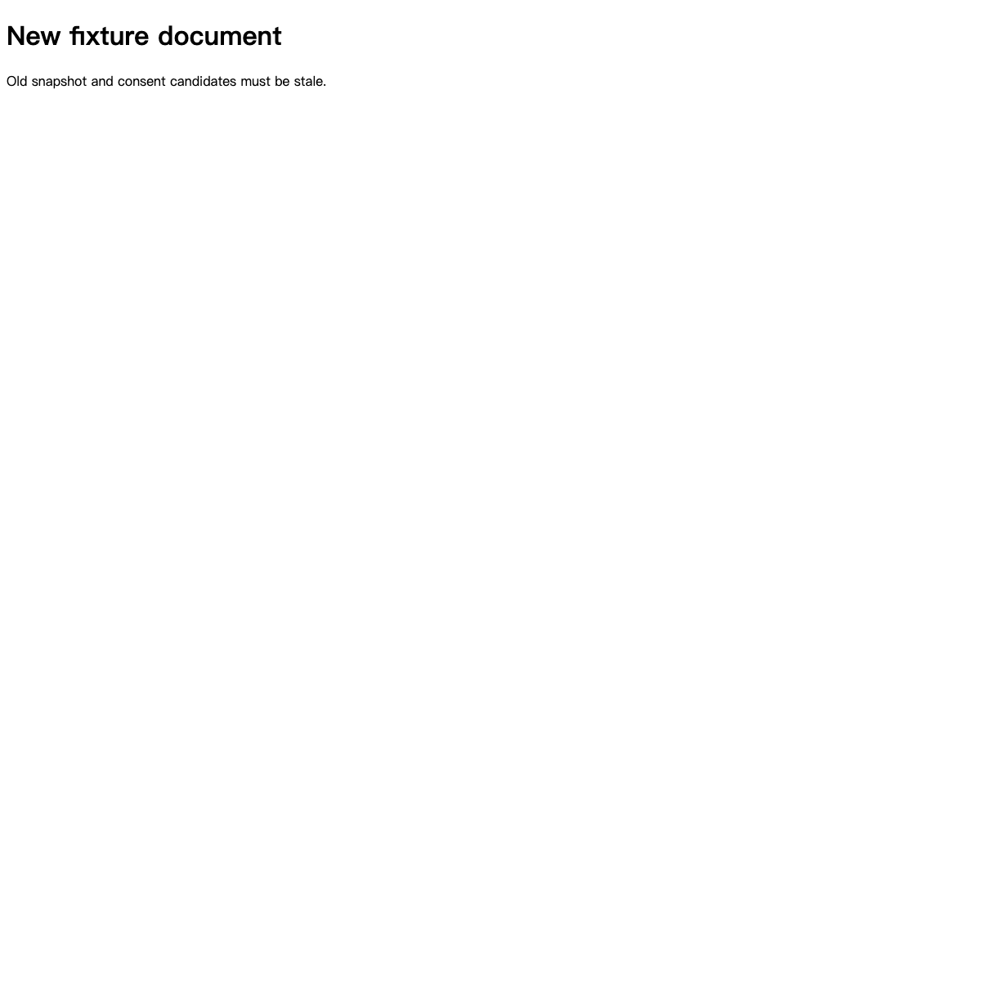

# Browser consent acceptance

Verified on 2026-10-02 with Chrome for Testing 149.0.7827.54 on Apple Silicon macOS 26.6.2. The isolated profile loaded the reviewed repository extension, an exact-extension-ID native-host manifest, a private Unix bridge, and local fixture pages. The daily browser and Nova/Bodhi installation were unchanged. This is developer-package evidence; it does not establish production distribution or the full #23 provider contract.

- Initial status: connected, zero registered top frames, unpaired. Opening the action did not inject a script.
- Clicking **Use this tab** registered one exact document, but Nova read remained rejected until the native Pair request was confirmed in the actual popup.
- After confirmation, the bridge returned the fixture heading, labelled Unicode field value, button and link with a document-scoped snapshot.
- Chrome's optional-permission dialog named only `nova-consent.test`. Denying it left the site ungranted; granting it showed **Revoke site access**. Chrome closes the popup while displaying this dialog, so reopen it to inspect the resulting access state.
- Revoking site access immediately cleared the pairing and registered route. An action using the previous snapshot was rejected; the fixture counter remained zero.
- After re-enabling and confirming the same document, navigation revoked the route with `document_unloaded`; an old snapshot action was rejected and the new page was not injected automatically.
- On `chrome://version`, the popup displayed an explicit unsupported-page message and disabled both access controls.

138 Node tests and the packaged-script syntax checks passed. Those fixtures separately cover candidate invalidation, dropped in-flight DOM results and the late permission-probe/new-epoch race; they are not a claim of real Windows browser acceptance.

The CLI's command-line extension installation initially enabled Chrome's file-access checkbox. It was explicitly disabled in this test profile before acceptance; incognito was already off. The extension itself declares only optional HTTP(S) origins, rejects file/restricted schemes, and registers no persistent content scripts. This screenshot records the test setting, not a claim about command-line installation defaults.

