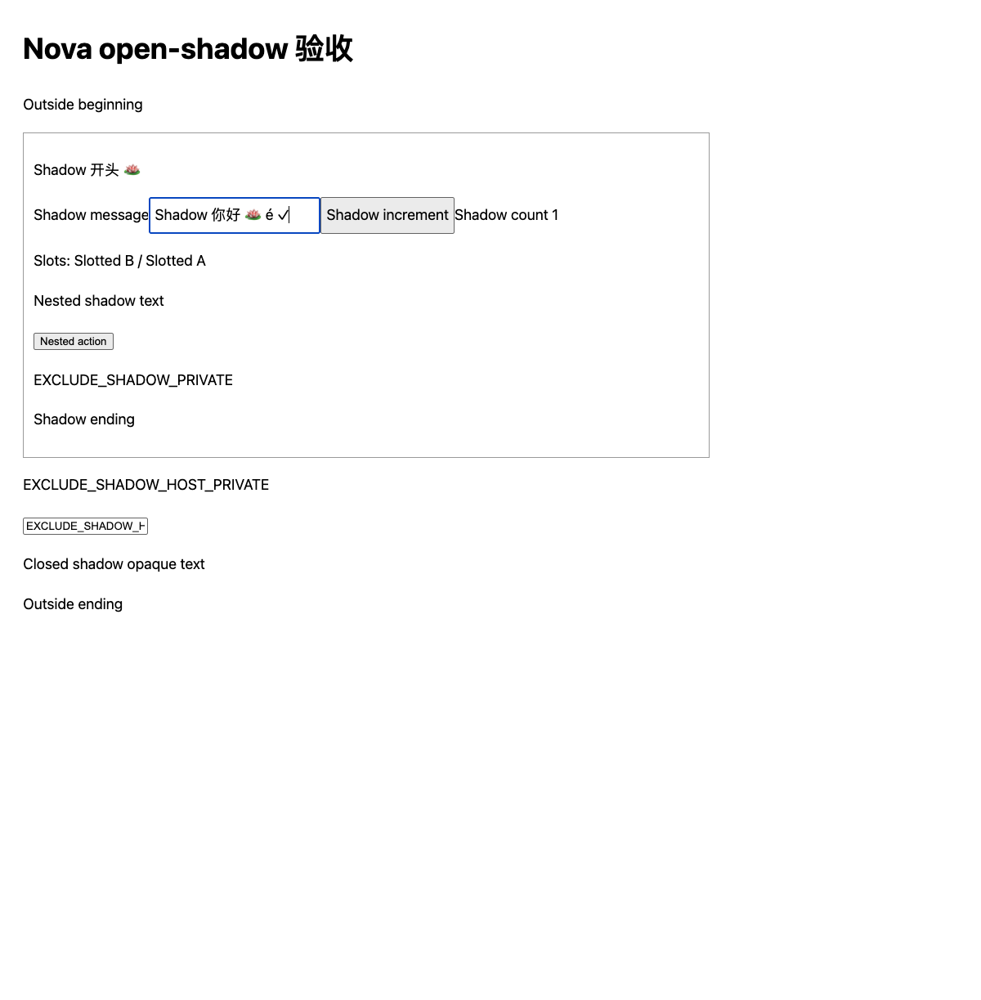
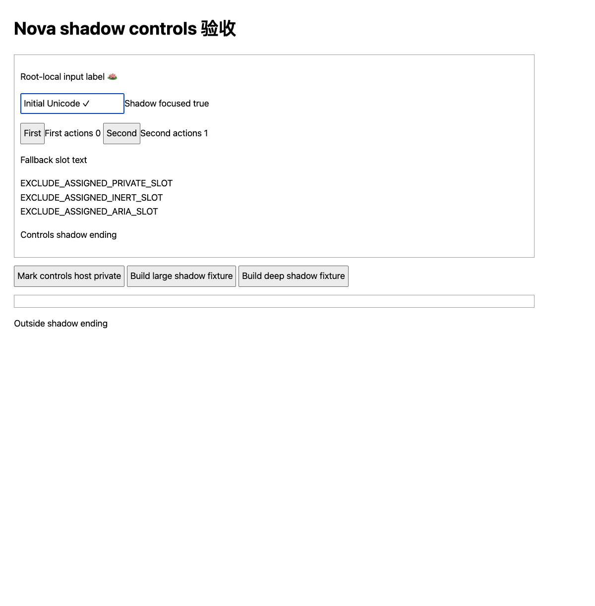
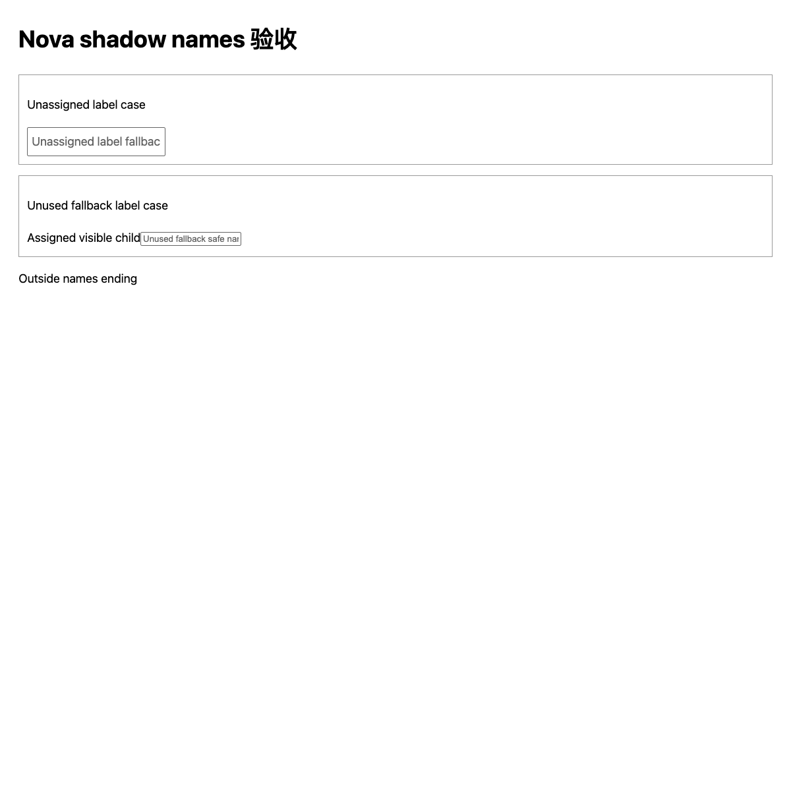

# Selected-page open shadow acceptance

Live acceptance passed for the #66 selected top-document read/action slice in an owned Chrome for Testing profile. Open and nested open roots share the existing traversal, privacy, payload and snapshot boundaries; slots use composition order without duplicate or unassigned content. Closed roots remain opaque and coverage stays `top_document`.

The original `chrome/fixtures/open-shadow.html` is byte-identical to the reviewed baseline fixture, SHA256 `2b15f78efeac8397348845d430cbebb896c4002630b407680349fa84204c8935`. Use an owned Chrome for Testing profile with the packaged extension and private broker/Native Messaging host, explicitly enable the selected tab and pair its exact current document. Retain the candidate revision/runtime hash, pair/read/action receipts and rendered screenshots. Keep daily Chrome, installed Nova/Bodhi, TCC and production host registration unchanged.

1. Load the original fixture. Confirm `Shadow 开头 🪷`, the `Shadow message` input with `Shadow Unicode ✓`, `Shadow increment`, `Shadow count 0`, `Nested shadow text`, `Nested shadow button` and `Shadow ending` appear alongside the outside light-DOM content. Slots must read **Slotted B** before **Slotted A**, once each; unassigned light text and every `EXCLUDE_` marker must be absent. Coverage stays `top_document`.
2. After a fresh snapshot for each mutation, focus and set the shadow input to a Unicode value, then activate `Shadow increment`. Confirm acknowledgements, actual input value/focus and visible count; a later read must show the new value/count. Verify the nested button remains addressable. Reject all text-node mutations and reject reuse after the first mutation attempt, including an unsuccessful attempt. Do not substitute a new document/route for the paired one.
3. Use `chrome/fixtures/open-shadow-controls.html` to verify fallback slots when no nodes are assigned, distinct handles for same-named controls, and own-root `aria-labelledby` names even when the document contains the same ID. A missing own-root ID must not borrow a document label. Hidden/inert/aria-hidden/private/sensitive host or slot content must not be returned. Read a control, click **Mark controls host private** outside the provider, then immediately confirm that its old target rejects the action without changing the DOM. The markers intentionally remain visually rendered; their absence from semantic output establishes the privacy boundary.
4. Use `chrome/fixtures/open-shadow-names.html` to confirm that unassigned light labels and unused slot fallback cannot become referenced control names. The safe placeholders remain readable, with no `EXCLUDE_` text or associated handle.
5. Exercise small `maxNodes` and `maxChars`, 1200 paragraphs and 200 nested open roots using the controls fixture's outside buttons. Confirm complete serialized JSON/UTF-8 budgets, explicit truncation and bounded completion. Retain receipts/timings and rendered screenshots for the limit cases.

The traversal and name reads share the existing 10,000-visit and 128-depth limits across roots and slots. Names and values retain 512/1024 UTF-16-unit limits with safe Unicode boundaries; text scans are limited to 4096 units. Snapshot limits include the complete JSON envelope and the UTF-8 wire reserve. Native `assignedNodes()` materializes Chrome's result; the runtime consumes assignments by index under the remaining budget without copying or recursively flattening that list.

## Observed results — 2026-10-02

Chrome for Testing 149.0.7827.54 on macOS arm64 ran the packaged candidate scripts with the existing immutable Native Messaging host and private Nova broker. Candidate runtime SHA256: `15ab2427ef3da20d671cb13549edc02f9923b6cc57c830a7c5b04c02887cd5bf`. The original fixture matches the hash above; controls/names fixture hashes are respectively `210044bb56dcf0612cf8303b3e3a973437b595fea9f134bd4f5f9e165a35816d` and `526782607f193166311fd05d66396ae1ca155b0ac4dce5f509c4e04b82e43358`. Each document was explicitly enabled and paired. File/incognito access remained off, with no persistent site grant, TCC or production host-registration change.

The reviewed #64 baseline returned five light-DOM nodes, omitted seven visibly rendered shadow segments/controls and read slots A then B. The candidate returned 15 nodes with open/nested text and controls present, B before A once, no excluded markers and no truncation. Closed-root text remained unavailable. All recorded reads preserved the paired document/route and empty actions for text nodes.

| Case | Actual result |
| --- | --- |
| Original input, fresh read before each action | `Shadow 你好 🪷 é ✓` written with the expected SHA256/UTF-8-byte receipt; later read and rendered page showed the same value |
| Original focus and increment | Own-root focus acknowledged; independent DOM observation confirmed input focus and host retargeting; later read and rendered page showed `Shadow count 1` |
| Read-only shadow text focus | Typed `unsupported_action`; counter and text unchanged |
| Own-root label and two same-named buttons | Correct local label; distinct handles; selecting the second produced First actions 0 / Second actions 1 |
| Host marked private after snapshot | Old input target rejected with `sensitive_control`; value stayed `Initial Unicode ✓`; next read omitted its controls |
| Unassigned and unused-fallback label references | Safe placeholder names only; excluded text absent from names and handles |
| `maxNodes=5` | 5 nodes, `truncated=true` |
| `maxChars=1024` | Complete snapshot JSON 887 UTF-16 units / 897 UTF-8 bytes, `truncated=true` |
| 1200 shadow paragraphs | 206 nodes, 99,541 UTF-16 units / 100,751 UTF-8 bytes; `truncated=true`, 0.095 seconds including local driver/bridge |
| 200 nested open roots | 5 outside nodes; depth-terminal text omitted, `truncated=true`, 0.062 seconds |

Independent review found that referenced labels initially bypassed composed-tree membership. A regression failed on both an unassigned light label and unused slot fallback; the minimal ancestry check now rejects both before text getters or handle storage. The repaired candidate passed all 158 extension tests with zero failures or skips, plus the complete syntax check. Node tests also cover private host/slot getters, nested focus, exact same-name handles, Unicode, complete payload bounds and 12,000 slot assignments without copying or flattening the browser list.

Pairing leaves the extension popup open. One focus setup attempt acknowledged DOM focus while the page's visible focus event waited for popup closure. After closing the popup, native UI and a fresh action/read both confirmed `Shadow focused true`; the original setup receipts were retained, without changing focus behavior or consent timing.

An ordinary HTTP origin exposed a pre-existing `set_value` defect: the value changed before `crypto.subtle` failed while preparing its acknowledgement. Those failed receipts and rendered evidence are retained and tracked separately in [#67](https://github.com/bigduu/Nova/issues/67); its digest/setter blocks were unchanged by #66. Positive Unicode-write acceptance used the byte-identical fixture on a loopback HTTP origin, where the browser exposes secure-context cryptography. This report does not claim successful writes on every HTTP origin. [Web Crypto](https://www.w3.org/TR/webcrypto/#crypto-interface) and [Secure Contexts](https://www.w3.org/TR/secure-contexts/#is-origin-trustworthy) describe that distinction.

Local evidence retains candidate/file identities, 15 passed case checks, 55 receipt/check records and rendered original/control/name/privacy/large/deep screenshots. These results do not complete parent #23: child frames, trusted input, general effect verification, automatic provider routing and production distribution remain outside this slice.

Implementation references: [open shadowRoot exposure](https://dom.spec.whatwg.org/#dom-element-shadowroot), [own node tree root](https://dom.spec.whatwg.org/#dom-node-getrootnode), [slot assignment and fallback](https://html.spec.whatwg.org/multipage/scripting.html#dom-slot-assignednodes), and [Document/ShadowRoot focus acknowledgement](https://html.spec.whatwg.org/multipage/interaction.html#dom-documentorshadowroot-activeelement).
