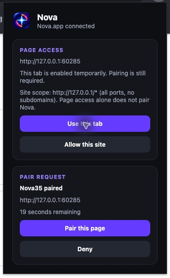
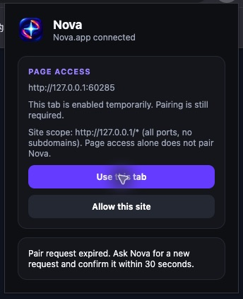
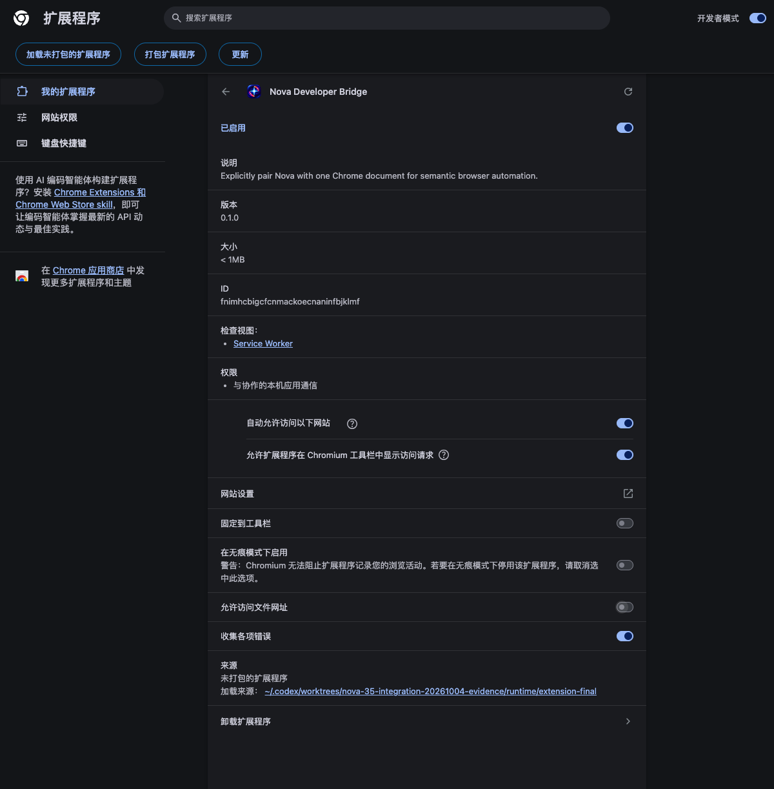
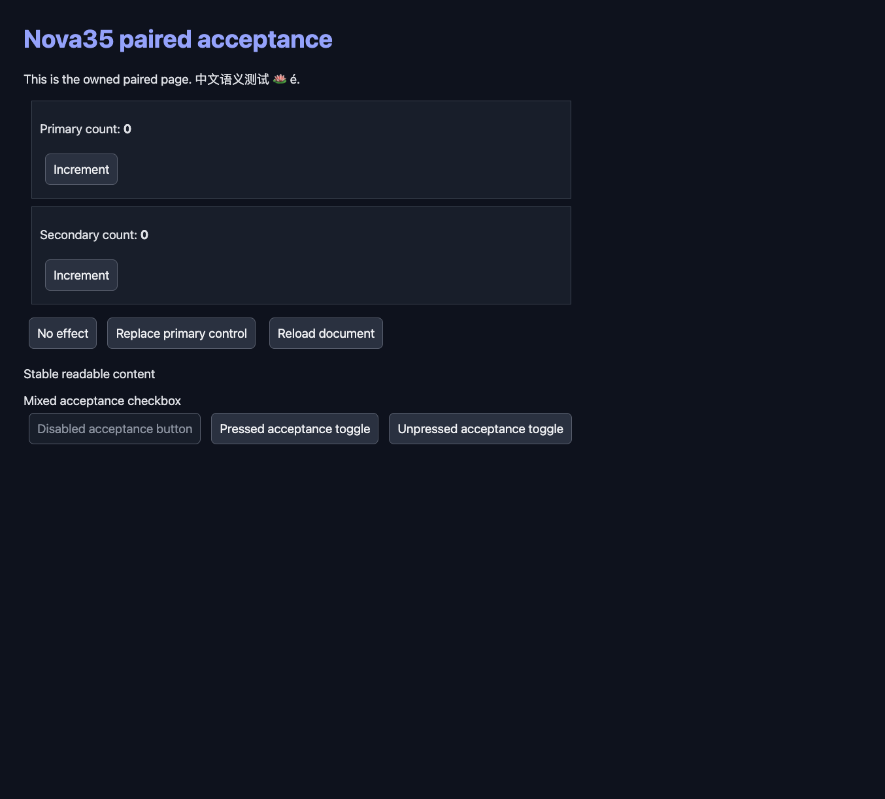

# Popup lifecycle acceptance (#35)

Validated on 2026-10-04 with official Chrome for Testing 154.0.8037.92,
macOS 26.6.2 and Apple Silicon. The isolated profile loaded an immutable copy
of all 22 tracked extension files from source candidate
`f2aa0fb4ebfb14e8338f30bea9dcfc8fc0f6320f`; their SHA256 values matched.
Chrome's displayed extension ID matched the private native-host manifest.

The private development Nova.app used the existing accepted core binaries.
Its Rust and native-host sources were byte-identical to merged Nova
`32bf4d90129e944f15e3a66b9e0ca1c72efe0da2` and build candidate
`364467b39731e9d2cb076ea48f21207dacaee9dc`. Product operations used public MCP
tools and genuine toolbar-popup clicks. No pairing response was synthesized.

## Actual action-popup flow

The normal toolbar action opened Nova on the owned HTTP fixture. **Use this
tab** enabled the exact document without pairing it. The popup stayed open
before the public `chrome_pair` request.

| Trigger | Actual popup observation | Public MCP result |
| --- | --- | --- |
| New Pair request | Reviewed fixture origin/title, countdown, Pair and Deny appeared without reopening | Genuine confirmation bound that document |
| Pair this page | Same popup changed to PAIRED and Release pairing | Canonical paired-page read returned 16 nodes, including Unicode content |
| External release | Same popup hid paired controls and showed “Pairing ended…” | Release succeeded |
| Actual 30-second expiry | Same popup hid pending controls and showed “Pair request expired…” | `pair_expired` |
| Navigate the fixture | Chrome closed its action popup; reopening showed “The page changed…” and no old paired controls | `document_unloaded`, zero registered frames, old canonical token rejected |
| Stop only the identified development Nova.app | Same popup showed “Nova.app unavailable…” and reconnect guidance | Native messaging disconnected |
| Restart that app | Same popup recovered to connected with no live pairing | Status was connected, unpaired and route-free |
| New explicit registration and confirmation after reconnect | Genuine Pair click showed the replacement document as PAIRED | New document/epoch and fresh canonical 16-node read succeeded |

Native accessibility observations and popup PNGs were captured for these
transitions. The screenshots below include actual popup overlays, separately
from the profile and dark fixture images.

Chrome's command-line extension load initially enabled file access. It was
explicitly disabled in the owned profile; incognito stayed off. This records
the acceptance setting, not an installation default. The test used temporary
tab access; real optional site/frame permission prompts were not part of this
current-candidate run.

An initial timeout observation was interrupted by a separately opened browser
tab and is not credited; the complete same-popup retry above passed. An early
post-restart MCP client correctly failed before the private app socket was
ready, and one later consent attempt expired before its click. Those attempts
are retained separately from the successful ready-client and confirmation.

All private Nova, native-host and MCP fixture processes were closed, and the
two owned profile registrations were removed. The browser and rendered dark
fixture were preserved because other tabs were in use. Daily Nova/Bodhi,
macOS privacy permissions and the user's running Windows VM were unchanged.

## Automated async coverage

`npm run check` and `npm test` passed on Node 26.10.0: 380 tests, zero failures,
skips or cancellations. The existing production worker/popup fixtures cover
serialized actions/reads, current and stale errors, delayed responses,
candidate reuse, navigation invalidation and direct permission gestures.

The independent review's two findings were repaired within this slice.
Revocation now notifies the popup before best-effort document cleanup; delayed
native events preserve their response ordering without restoring old popup
state. Frame metadata removal uses accurate recovery text while preserving
site access. Six focused regressions failed before repair and passed after it;
the combined popup/worker suite passed 130 tests.

Actual Chrome observations and hermetic async tests are separate evidence.
This establishes the development extension's popup lifecycle on macOS, not
production distribution, TCC grants, real Windows popup acceptance or every
criterion of parent #23. CI uses its configured Node 22 extension lane.
