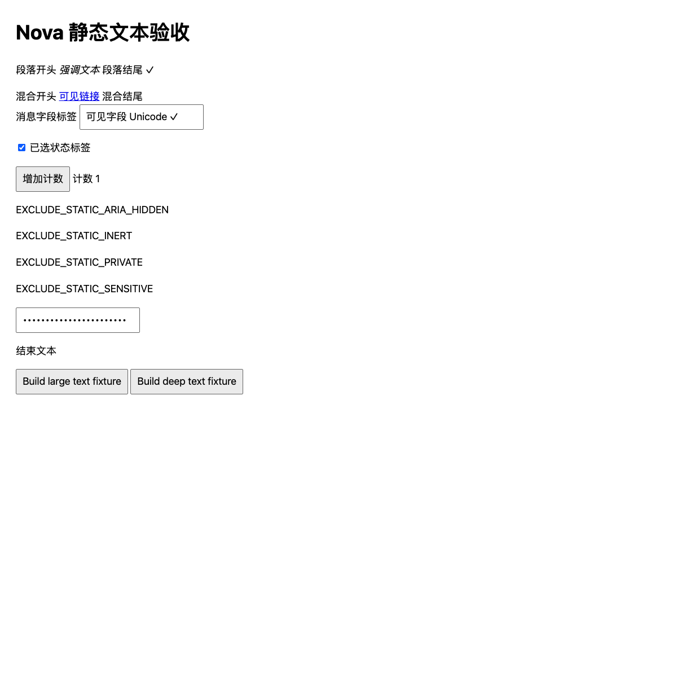
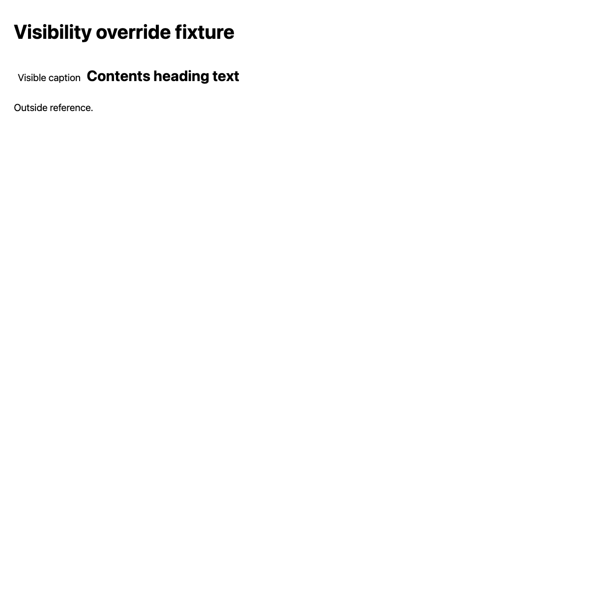

# Top-document static text acceptance

The candidate includes visible DOM text runs as `role: "text"`, with empty actions. It keeps headings, links and controls in DOM reading order while omitting their duplicate descendant text. Paragraphs, inline emphasis, labels and output text remain readable. Explicit hidden/inert/aria-hidden and sensitive markers, plus script/style/template contents, are excluded before text output or handles. Child frames and shadow trees are outside this slice.

Reads retain the existing document/route and snapshot envelope. A fresh read supplies new snapshot/node identifiers; one attempted mutation consumes that snapshot, including a rejected text-node action. Read again before testing a control action.

Limits: at most the requested nodes (default 500, maximum 1000), names of 512 UTF-16 units without splitting a Unicode character, and the complete snapshot JSON within the requested character budget (default 100,000, clamp 1024–500,000). A snapshot also stays below the existing 1 MiB wire ceiling with 4096 bytes reserved for its route envelope. Traversal/name reads share 10,000 visited steps, stop at 128 nested levels, and inspect at most 4096 text units per run/name. Any cut reports `truncated: true`; coverage stays `top_document`. CSS-rendered text may be outside the viewport; this read does not establish occlusion or additional frame coverage.

## Owned-browser procedure

Use an isolated Chrome for Testing profile, the packaged candidate extension and the existing private native bridge. Do not change daily profiles, TCC or production host registration. `chrome/fixtures/static-text.html` is byte-identical to the #56 baseline fixture; SHA256 `7b55529baaacc6e13cca64a656b62bda343e24d1fc83a92f132b4eb6cf9b2fed`.

1. Serve the fixture over the owned local HTTP test origin. Enable **Use this tab**, issue Pair and confirm the exact document in the extension popup. Save the candidate identity, fixture screenshot and actual bridge read receipt.
2. Verify the heading/control names and existing actions remain present. Check these seven previously absent runs in order: `段落开头`, `强调文本`, `段落结尾 ✓`, `混合开头`, `混合结尾`, `计数 0`, `结束文本`. Confirm external/wrapped labels are readable and link/button/heading descendant names appear once.
3. Search the actual serialized receipt for `EXCLUDE_STATIC_`; none may appear. Check every text node has empty actions. With a fresh read for each attempt, target a text node with activate, focus, set_value and scroll; expect `unsupported_action` and unchanged fixture content.
4. Read again, find the existing `增加计数` button and activate its current node. Confirm the rendered counter becomes 1, then a new read contains `计数 1`. Save both visible and bridge evidence. Actions in this slice retain the existing DOM capability behavior; they do not claim trusted input or an effect protocol.
5. Request a small `maxNodes` and `maxChars` (at least 1024); verify the serialized snapshot stays within each limit and reports truncation. Activate **Build large text fixture** on a fresh snapshot; confirm bounded read/truncation of 1200 paragraphs. Activate **Build deep text fixture** on a fresh snapshot; confirm bounded read and explicit truncation at the depth limit, without following 200 levels to terminal text. Save all receipts and rendered screenshots.

Node fixtures additionally cover astral Unicode at the name boundary, invalid UTF-16, text range visibility, sensitive descendants/references, full JSON/UTF-8 budgets, 12,000 empty nodes and 2000-deep trees. These are deterministic test evidence. The final extension syntax check and complete test suite passed: 149 tests, zero failures or skips.

## Observed results — 2026-10-02

Chrome for Testing 149.0.7827.54 on macOS arm64 used an owned profile, the packaged candidate scripts and an immutable Native Messaging host. Traffic terminated in the private Nova broker fixture; installed Nova/Bodhi were monitored for continuity. Incognito/file access remained off and no persistent site grant or TCC setting was changed. The original fixture bytes match the SHA256 above. The baseline #56 read returned seven controls and omitted all seven text runs while reporting no truncation; the candidate returned 16 ordered nodes with those runs and external/wrapped labels included. All serialized reads excluded `EXCLUDE_STATIC_` markers.

| Case | Actual bridge result |
| --- | --- |
| Original fixture | 16 nodes, `top_document`, `truncated=false`; heading/link/button names appeared once |
| Text activate/focus/set_value/scroll, each after a fresh read | Four typed `unsupported_action` results; text and counter stayed unchanged |
| Fresh-read increment button | Successful existing action; next snapshot and rendered page both showed `计数 1` |
| `maxNodes=5` | 5 nodes, `truncated=true` |
| `maxChars=1024` | 900 UTF-16 units for the complete snapshot JSON, `truncated=true` |
| 1200 paragraphs | 359 nodes, 99,940 UTF-16 units; `truncated=true`, 0.104 seconds including the local driver/bridge |
| 200 nested levels | 16 original nodes, `truncated=true`; terminal text omitted by the depth bound, 0.050 seconds |
| Visible descendant of a hidden button; heading with `display:contents` | Both rendered captions returned as read-only text; no hidden button action was exposed |

The final visibility case uses the same origin with `<button style="visibility:hidden">Visible caption</button>` and `<h2 style="display:contents">Contents heading text</h2>`. It also has an ordinary paragraph and a `display:none` exclusion marker. Named-parent deduplication applies only when that parent is rendered. This checks the real Range path in addition to the regression fixture.

Two setup pairing attempts expired before confirmation (the popup displays origin, and a second tool round trip exceeded the 30-second window). After preparing the confirmation action before requesting Pair, both exact fixture documents were explicitly paired and all cases above completed. Failed setup receipts were retained; no permission or deadline was weakened.

Local evidence retains immutable candidate/file identities, pair/read/action receipts, timing checks and large/deep screenshots. These results establish the selected top-document read slice; they do not claim shadow/frame, trusted-input, automatic provider routing or production distribution acceptance.

Implementation references: [DOM tree order](https://dom.spec.whatwg.org/#concept-tree-order) and [CSSOM Range rectangles](https://drafts.csswg.org/cssom-view/#dom-range-getclientrects).
