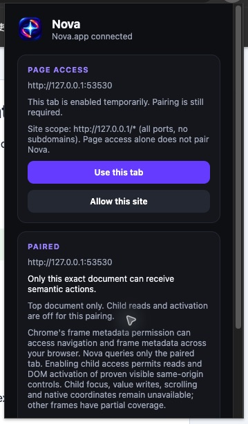
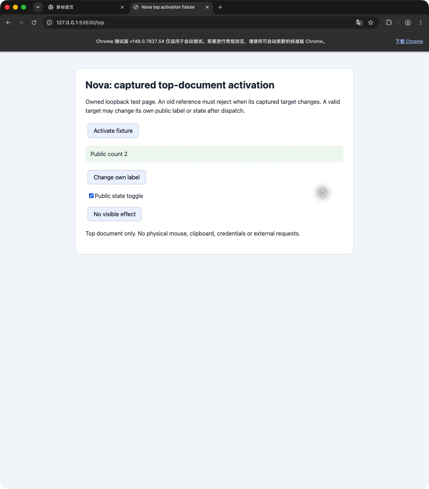

# Captured top-document activation acceptance

Nova #81 is a focused child of tracker #23. A top-document activation handle now retains the existing private role/name/type fingerprint. Immediately before dispatch, the existing bounded activation-before observation must still contain the exact captured DOM element, its unchanged fingerprint and current `activate` eligibility. A renamed, role/type-changed, disabled or hidden/inert target rejects with `stale_node` before any DOM dispatch. Sensitive and detached targets keep their existing typed denials. The rejected mutation consumes its snapshot.

This reuses the existing child-target comparison and bounded observation; it adds no traversal, polling, cache, lifecycle protocol or public fields. The comparison runs only before dispatch. A still-valid handler may change its own public label/state and receive the existing minimal `{ activated: true }` observed-effect receipt. Existing cumulative budgets, absolute deadline, privacy redaction and no-effect inspection guidance remain in force. Read again after target changes; no re-resolution or replay is performed by an activation request.

## Fresh actual Chrome before and after

On 2026-10-03 (Asia/Shanghai), root used two new private Chrome for Testing 149.0.7827.54 profiles with immutable accepted/candidate extension payloads, the accepted native host and serial broker. Both runs used the same byte-identical owned loopback fixture, actual temporary-tab enablement and exact-document UI pairing. No simulated production worker/route was used. Child access stayed off.

| Actual case | Accepted baseline `e0e55a949bda` | Repaired candidate |
| --- | --- | --- |
| Rename, role, ARIA-disabled, hidden/inert target, hidden/inert ancestor (7) | Each dispatched once and wrongly confirmed an effect | Each rejects `stale_node`, zero dispatch |
| Native disabled target | Native click suppression, zero dispatch, `no_observed_effect` | `stale_node` before dispatch |
| Newly private target / same-label replacement | Existing sensitive/stale denials, zero dispatch | Same denials, zero dispatch |
| Exact valid public target / own public label / checkbox state | One dispatch and minimal observed-effect receipt each | Same successful behavior |
| No visible effect | One dispatch, `no_observed_effect`, inspection guidance | Same bounded no-effect result |
| Fresh read after a rename | Not an extra baseline case | New captured target activates once |

The baseline recorded 14 cases and seven reproduced missing guards. The repaired candidate passed 15 cases; all ten changed-target attempts had zero dispatch. Every attempted consumed reference rejected its second activation with zero additional dispatch; all bystander/replacement counters stayed unchanged. All Nova DOM dispatches were untrusted, as expected. Raw native replies and independent MAIN-world fixture counters support the matrix; no receipt echoes observed text or values.

The screenshots are unchanged native JPEG captures. Candidate native/Chrome resources and the shared fixture server closed normally; the earlier accepted-baseline Chrome also exited, and the native host disconnected after each run. One candidate pairing request expired while the harness refreshed an old AX state; a fresh actual UI-confirmed request succeeded before any activation case. The original expired reply and UI guard misses remain recorded, without a product change or action replay.

Frozen before-manifest SHA256: `1951c4c3e22625018bb4d8543b427393634f916d31a050084f33b9c929f6642e`. Frozen repaired-manifest SHA256: `d1d3fd5c71fdbe204d1b0012f4c1fc1b27e80d91aef71bb4e32bbeb46ba9c57d`. The external evidence includes exact payload/fixture hashes, native replies, independent counters, command/UI logs and original screenshots.

## Reproduce this slice

Serve `chrome/fixtures/top-activation.html` on loopback in an owned empty profile, for example `python3 -m http.server 8765 --bind 127.0.0.1 --directory chrome/fixtures`. Load the exact extension/private host, choose **Use this tab**, then complete a new actual **Pair this page** request for that document.

1. Read and capture the **Activate fixture** handle. Independently change that owned fixture through `window.NovaTopActivationProof.changeTarget(kind)`, with `kind` one of `rename`, `role`, `disabled`, `aria-disabled`, `hidden`, `inert`, `owner-hidden`, `owner-inert`, `private` or `replace`. Activate the old handle. Require the typed denial and zero dispatch from `inspect()`; retrying its consumed reference must also leave every counter unchanged. Restore between cases using `restore()`.
2. From separate fresh snapshots, activate **Activate fixture**, **Change own label**, **Public state toggle** and **No visible effect**. Check exact target counter increments, own-label/check state, bounded minimal success or no-effect guidance, and zero replay. Rename before a fresh read, then activate its newly captured handle once.

The same 12 permanent hermetic regressions first produced two valid positives and ten stale-target failures on the accepted runtime, then 12/12 PASS after repair. They also cover type/other-actionable-role changes and a same-label decoy that changes snapshot ordering. Full extension tests are 355/355 PASS (zero fail/skip/cancelled/todo), packaged syntax and whitespace checks PASS. One existing manual unit handle uses the existing captured-handle helper to supply its private fingerprint. Independent review and all eight exact-head CI checks gate delivery. This child leaves focus/value/scroll, frame routing, native coordinates, TCC and packaged OS acceptance outside scope; tracker #23 remains open.
