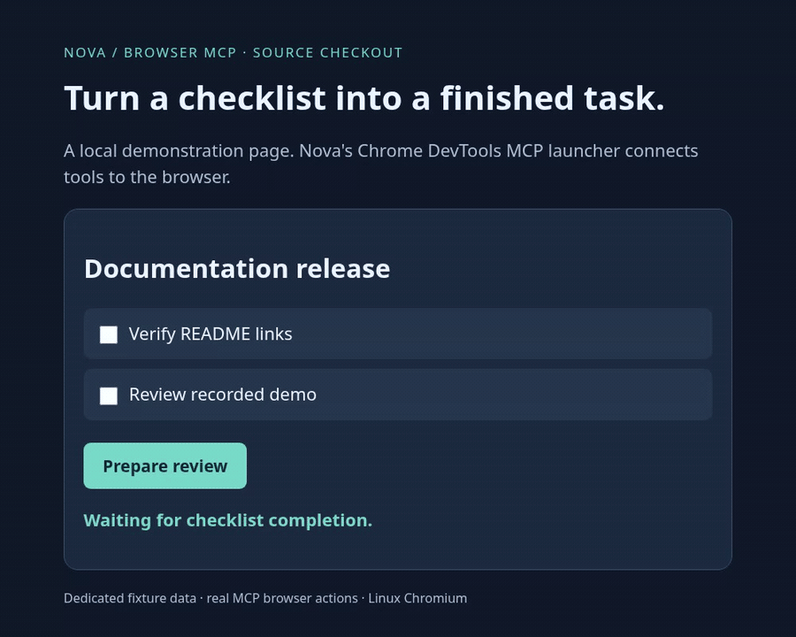

# Browser checklist recording



[Static final frame](browser-checklist.png) · [MCP request/results](browser-evidence.json) · [Recording script](record-browser.mjs) · [Local fixture](fixture.html)

This is a **source-checkout demonstration**, recorded on Linux from the runtime
source at reachable Nova revision
[`19dfeaa1e49fd186202f731c92d2f7ec9b6539af`](https://github.com/bigduu/Nova/commit/19dfeaa1e49fd186202f731c92d2f7ec9b6539af).
The original recording workspace included a local, unpublished documentation-only
commit; it is not a public reproduction ref. The recording script, fixture and
MCP transcript are preserved in this directory. The `chrome-devtools` launcher
shown here is **not in the published v0.2.1 release**, despite the source manifest
still using that version string.

The script launches the built Nova binary, initializes its actual stdio MCP
transport, navigates to a dedicated local page, reads its accessibility snapshot,
clicks two checkboxes by their returned UIDs, and clicks “Prepare review”. It
asserts the resulting live page status before saving the screenshot. The labels
are demonstration data: this does not check repository links or review any real
release. There is no model call, user profile, account, credential, or private data.

## Recording environment and scope

- Nova delegates to the source-pinned official `chrome-devtools-mcp@1.8.0`.
- A temporary runner passed through Nova's documented `--npx PATH` appends the
  upstream `--browserUrl=http://127.0.0.1:9752` option. That connects a **dedicated
  disposable Playwright browser**, allowing Playwright's actual video recording.
  Nova itself does not currently expose `--browserUrl`; this adapter is recording
  infrastructure, not a normal product installation step. All browser mutations
  in the demonstration are MCP calls, not Playwright actions.
- The Nova-provided privacy arguments remain intact. The dedicated fixture server
  binds only to `127.0.0.1:9751`; the recording browser uses no daily browser profile.
- Verified with Rust 1.95.0, Node 24.19.0 and the environment's Playwright Chromium.
  No native GUI, macOS, Windows, existing-profile connection, extension, WebMCP,
  autonomous reasoning, or real-world task acceptance is claimed.
- The GIF is the recorded WebM converted by FFmpeg, with startup blank frames
  trimmed and no generated, composited, or simulated action frames. It is
  900 × 720, 137 frames at 8 fps (17.13 seconds), 1,794,592 bytes, and loops forever.
  Four decoded frames were visually reviewed for legibility and actual state
  transitions; the final PNG provides the non-animated alternative.

## Reproduce

Use an available Playwright installation with its Chromium and FFmpeg. From the
Nova repository root (the two loopback ports above must be free):

```sh
cargo build --locked --bin nova
NOVA_BIN=/absolute/path/to/target/debug/nova \
PLAYWRIGHT_MODULE=/absolute/path/to/node_modules/playwright \
node docs/demos/record-browser.mjs
```

The script prints `TRIM_SECONDS` and the temporary `VIDEO` path. Convert that
recording using the printed trim value and video path:

```sh
ffmpeg -ss "$TRIM_SECONDS" -i "$VIDEO" \
  -vf 'fps=8,scale=900:-1:flags=lanczos,split[s0][s1];[s0]palettegen=max_colors=128[p];[s1][p]paletteuse=dither=bayer:bayer_scale=3' \
  -loop 0 -y docs/demos/browser-checklist.gif
```

The temporary directory intentionally retains the original WebM for inspection.
Delete that recording directory when finished. The script closes its own browser,
MCP child and fixture server; it does not touch other running services.
